## VMware虚拟机逃逸漏洞分析

#### 0x00 漏洞编号
|修补时间|编号|
|---|---|
|2017-03-14|CVE-2017-4901|


#### 0x01 影响范围
|产品|版本|级别|修补版本|
|---|---|---|---|
|Workstation Pro|12.x|严重|12.5.4|
|Fusion Pro<br>Fusion|8.x|严重|8.5.5|

#### 0x02 漏洞简介
在VMware Workstation和Fusion中的拖放（Dnd）和复制粘贴（CP）功能存在堆溢出漏洞，这会让虚拟机客户端在宿主机上执行任意代码。


#### 0x03 漏洞原理

*** 1. RPCI通信机制 ***

在介绍漏洞原理之前，先来了解一下VMWare中宿主机(host)与虚拟机(guest)之间的通信机制，其中的一种方式叫做Backdoor，利用windows的特权指令in，该指令在正常的host环境用户态中执行会报异常，而在guest中正是利用该异常被host的hypervisor捕获，来实现通信。
如下图，在vmtools.dll中的Message_Send函数调用Backdoor函数，Backdoor调用in eax,dx来实现通信。


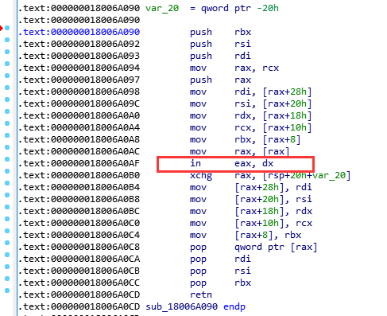

guest中利用frida框架注入到vmtools.exe中使用RpcChannel_SendOneRaw发送消息

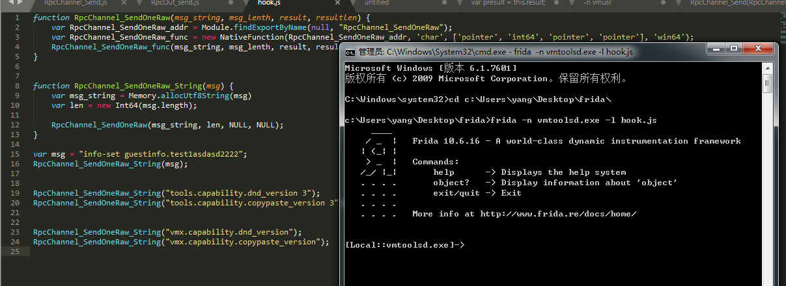

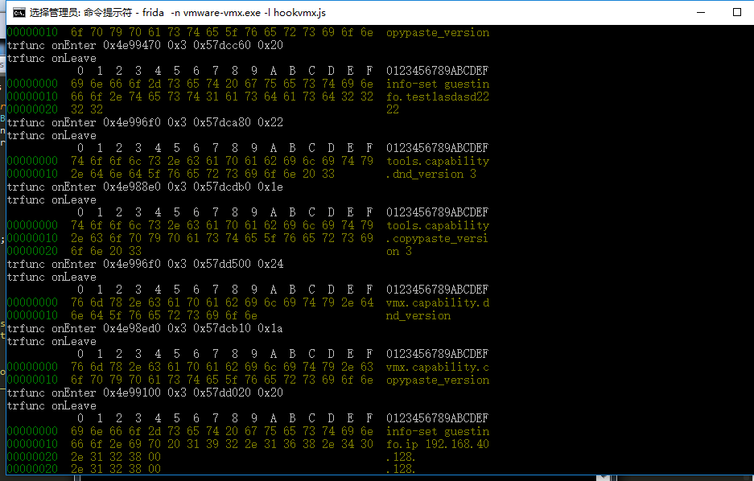

```
gboolean
RpcChannel_SendOneRaw(const char *data,
                      size_t dataLen,
                      char **result,
                      size_t *resultLen);
```
RpcChannel_SendOneRaw调用路径：
RpcChannel_SendOneRaw -> RpcChannel_Send -> BkdoorChannelSend -> RpcOut_send -> Message_Send -> Backdoor -> in特权指令

RpcChannel_SendOneRaw的参数 const char *data就是给Host发送的指令， 在第3小节会讲host是怎么接收guest 的命令。


*** 2. 漏洞 ***

Dnd/CP的Version 4的dnd/cp分片数据包校验函数
```
static Bool
DnDCPMsgV4IsPacketValid(const uint8 *packet,
                        size_t packetSize)
{
   DnDCPMsgHdrV4 *msgHdr = NULL;
   ASSERT(packet);

   if (packetSize < DND_CP_MSG_HEADERSIZE_V4) {
      return FALSE;
   }

   msgHdr = (DnDCPMsgHdrV4 *)packet;

   /* Payload size is not valid. */
   if (msgHdr->payloadSize > DND_CP_PACKET_MAX_PAYLOAD_SIZE_V4) {
      return FALSE;
   }

   /* Binary size is not valid. */
   if (msgHdr->binarySize > DND_CP_MSG_MAX_BINARY_SIZE_V4) {
      return FALSE;
   }

   /* Payload size is more than binary size. */
   if (msgHdr->payloadOffset + msgHdr->payloadSize > msgHdr->binarySize) {//[1]
      return FALSE;
   }

   return TRUE;
}

Bool
DnDCPMsgV4_UnserializeMultiple(DnDCPMsgV4 *msg,
                               const uint8 *packet,
                               size_t packetSize)
{
   DnDCPMsgHdrV4 *msgHdr = NULL;
   ASSERT(msg);
   ASSERT(packet);

   if (!DnDCPMsgV4IsPacketValid(packet, packetSize)) {
      return FALSE;
   }

   msgHdr = (DnDCPMsgHdrV4 *)packet;

   /*
    * For each session, there is at most 1 big message. If the received
    * sessionId is different with buffered one, the received packet is for
    * another another new message. Destroy old buffered message.
    */
   if (msg->binary &&
       msg->hdr.sessionId != msgHdr->sessionId) {
      DnDCPMsgV4_Destroy(msg);
   }

   /* Offset should be 0 for new message. */
   if (NULL == msg->binary && msgHdr->payloadOffset != 0) {
      return FALSE;
   }

   /* For existing buffered message, the payload offset should match. */
   if (msg->binary &&
       msg->hdr.sessionId == msgHdr->sessionId &&
       msg->hdr.payloadOffset != msgHdr->payloadOffset) {
      return FALSE;
   }

   if (NULL == msg->binary) {
      memcpy(msg, msgHdr, DND_CP_MSG_HEADERSIZE_V4);
      msg->binary = Util_SafeMalloc(msg->hdr.binarySize);
   }

   /* msg->hdr.payloadOffset is used as received binary size. */
   memcpy(msg->binary + msg->hdr.payloadOffset, //[2]
          packet + DND_CP_MSG_HEADERSIZE_V4,
          msgHdr->payloadSize);
   msg->hdr.payloadOffset += msgHdr->payloadSize;
   return TRUE;
}

```
open-vm-tools中的代码在此：[dndCPMsgV4.c](https://github.com/vmware/open-vm-tools/blob/master/open-vm-tools/services/plugins/dndcp/dnd/dndCPMsgV4.c)

对于Dnd/CP version 4的功能中，当guest发送分片Dnd/CP命令数据包时，会调用DnDCPMsgV4_UnserializeMultiple函数进行分片重组，重组的时候 DnDCPMsgV4IsPacketValid函数中的[1]处代码校验不严格，会导致[2]处堆溢出，可以构造如下的数据包来触发漏洞
```
packet 1 {
	sessionId : 0x41414141
	binarySize： 0x100
    payloadOffset: 0
    payloadSize : 0x50
    ...
    //0x50 bytes binary
}
发送packet 1时，DnDCPMsgV4IsPacketValid函数的校验的不会有问题

packet 2 {
	sessionId : 0x41414141
	binarySize： 0x1000
    payloadOffset: 0x50
    payloadSize : 0x100
    ...
    //0x100 bytes binary
}
在发送后续的分片包时，DnDCPMsgV4IsPacketValid的校验就已经无效了，可以指定更大的binarySize来绕过校验
```

Dnd/CP的Version 3的dnd分片数据包校验函数
```
Bool
DnD_TransportBufAppendPacket(DnDTransportBuffer *buf,          // IN/OUT
                             DnDTransportPacketHeader *packet, // IN
                             size_t packetSize)                // IN
{
   ASSERT(buf);
   ASSERT(packetSize == (packet->payloadSize + DND_TRANSPORT_PACKET_HEADER_SIZE) &&
          packetSize <= DND_MAX_TRANSPORT_PACKET_SIZE &&
          (packet->payloadSize + packet->offset) <= packet->totalSize &&
          packet->totalSize <= DNDMSG_MAX_ARGSZ);

   if (packetSize != (packet->payloadSize + DND_TRANSPORT_PACKET_HEADER_SIZE) ||
       packetSize > DND_MAX_TRANSPORT_PACKET_SIZE ||
       (packet->payloadSize + packet->offset) > packet->totalSize || //[3]
       packet->totalSize > DNDMSG_MAX_ARGSZ) {
      goto error;
   }

   /*
    * If seqNum does not match, it means either this is the first packet, or there
    * is a timeout in another side. Reset the buffer in all cases.
    */
   if (buf->seqNum != packet->seqNum) {
      DnD_TransportBufReset(buf);
   }

   if (!buf->buffer) {
      ASSERT(!packet->offset);
      if (packet->offset) {
         goto error;
      }
      buf->buffer = Util_SafeMalloc(packet->totalSize);
      buf->totalSize = packet->totalSize;
      buf->seqNum = packet->seqNum;
      buf->offset = 0;
   }

   if (buf->offset != packet->offset) {
      goto error;
   }

   memcpy(buf->buffer + buf->offset,
          packet->payload,
          packet->payloadSize);
   buf->offset += packet->payloadSize;
   return TRUE;

error:
   DnD_TransportBufReset(buf);
   return FALSE;
}
```
open-vm-tools中的代码在此：[dndCommon.c](https://github.com/vmware/open-vm-tools/blob/master/open-vm-tools/services/plugins/dndcp/dnd/dndCommon.c#L722)

对于老版本Version 3的Dnd/CP的功能中，在[3]处同样对分片重组的包有着校验失效的问题，可以发送如下的数据包来触发溢出。

```
packet 1 {
	seqNum: 0x41414141
	totalSize： 0x100
    payloadSize : 0x50
    offset: 0
    ...
    //0x50 bytes buffer
}
发送packet 1时，DnD_TransportBufAppendPacket函数中[3]处不会有问题，

packet 2 {
	seqNum : 0x41414141
	totalSize： 0x1000
    payloadSize : 0x100
    offset: 0x50
    ...
    //0x100 bytes buffer
}
在发送后续的分片包时，DnD_TransportBufAppendPacke的校验就已经无效了，可以指定更大的totalSize来绕过校验
```

*** 3. 漏洞原理 ***

第2节看完open-vm-tools中漏洞溢出的地方，现在来看vmware-vmx.exe中怎么利用漏洞实现逃逸。

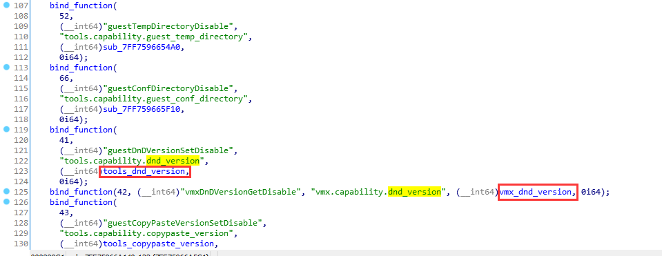
bind_function会把RPCI通信的命令和函数绑定到一个函数指针数组里面。
bind_function第3个参数是命令的名字，第4个参数是对应处理的回调函数。
回调函数的定义如下：
char __fastcall handler(__int64 a1, __int64 a2, const char * request, int requestlen, const char **result, _DWORD *resultlen);

handler第三个参数是接收的命令， 第5个参数是回复给guest的数据。

发送如下命令可以设置和查询dnd/cp的版本
```
tools.capability.dnd_version 3			//设置dnd的版本为3
tools.capability.copypaste_version 3	//设置cp的版本为3
vmx.capability.dnd_version				//查询dnd的版本
vmx.capability.copypaste_version		//查询cp的版本
```

讲完host如何接收guest的命令后，来看看guest的堆溢出怎么触发host的逃逸


在处理guest的"tools.capability.dnd_version 3"命令时，设置当前的dnd_version

在处理guest的"vmx.capability.dnd_version"命令时，会获取当前的dnd_version，并且更新dnd/cp全局对象
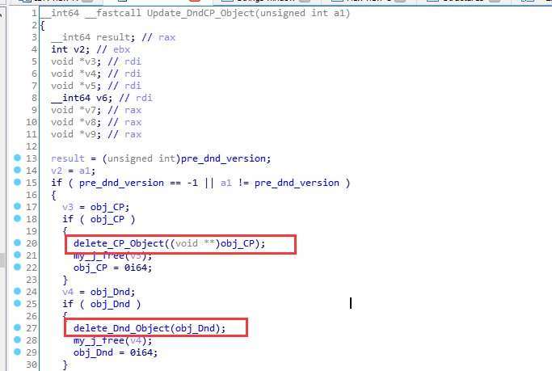
在Update_DndCP_Object函数中delete掉前一个版本的obj_CP和obj_Dnd， 析构对象的时候都会调用到他们各自的虚函数，只需要溢出到虚表上就能执行漏洞代码。
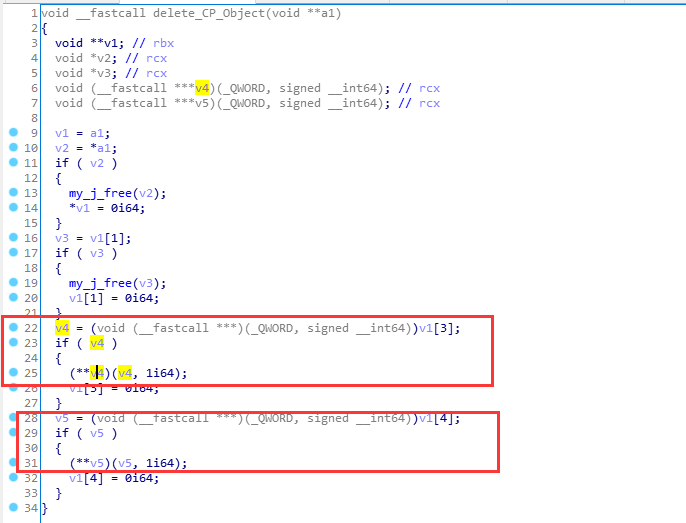
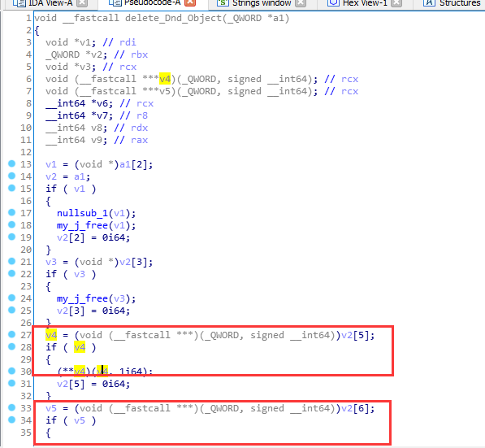
能够执行代码的路径很多，可以溢出Dnd，也可以溢出CP, 只需要选择溢出其中一个虚函数。

#### 0x04 绕过ASLR
要想在guest中获取host的对象，就需要有个能够泄漏信息的地方，例如guest中发送info-set和info-get命令。
```
info-set guestinfo.KEY VALUE  //设置key/value键值对
info-get guestinfo.KEY  		//获取key的值
```
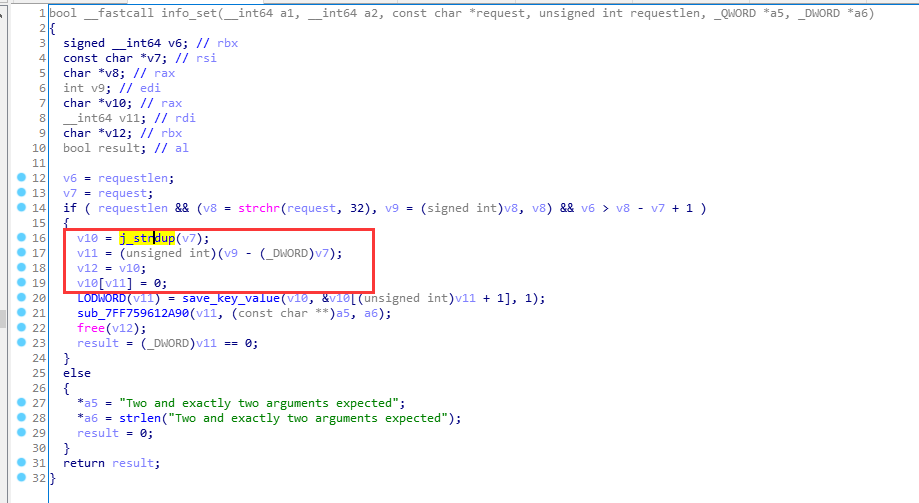
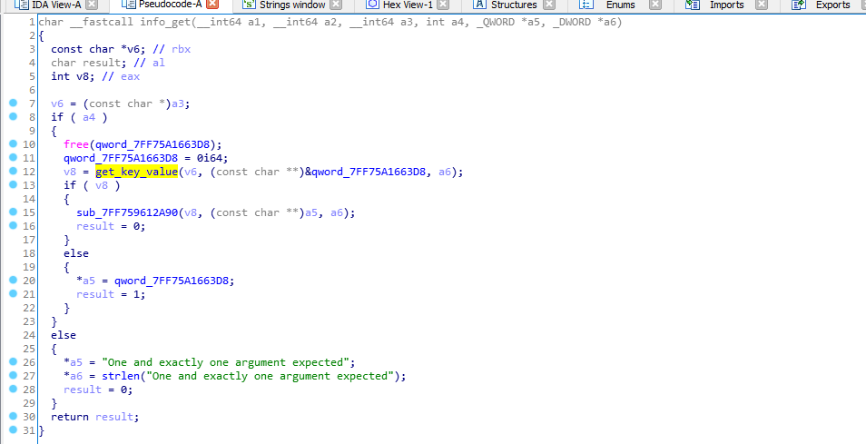
利用info-set覆盖字符串的结尾NULL字符，让value字符串与后面的内存块连接起来，然后在info-get中读取Key，就能获取到value字符串后面的内存，达到信息泄漏。

#### 0x05 Exploit分析
此次分析的exp是由unamer发布在github上的[vmware_escape](https://github.com/unamer/vmware_escape)项目。

*** 1. 设置DnD/CP版本***


*** 2. 绕过ASLR***
多次发送info-set, info-get，进行堆溢出
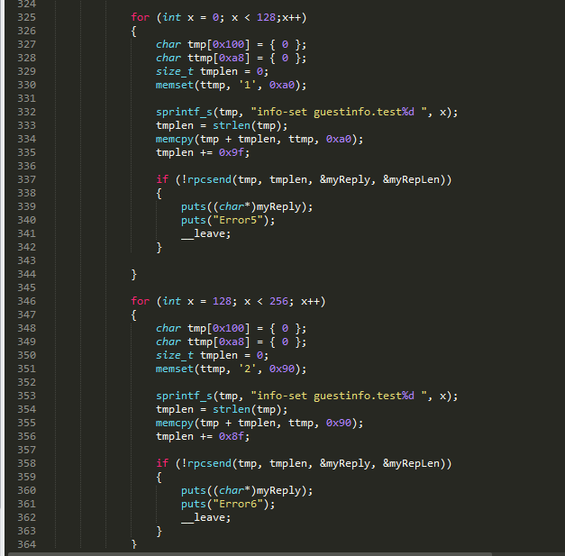
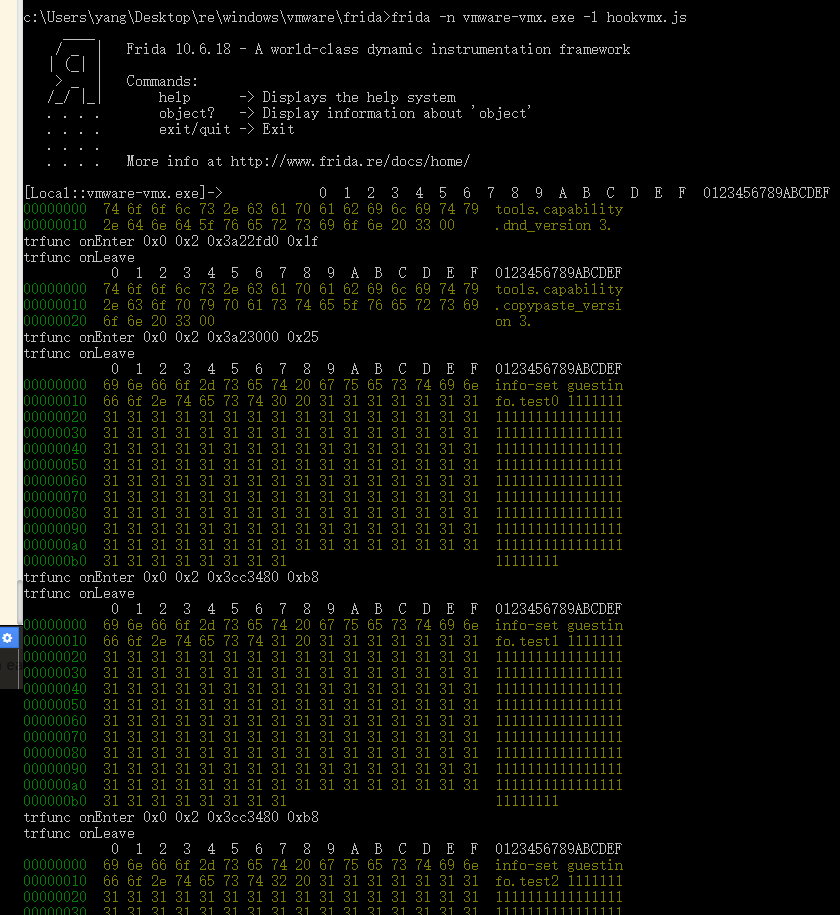
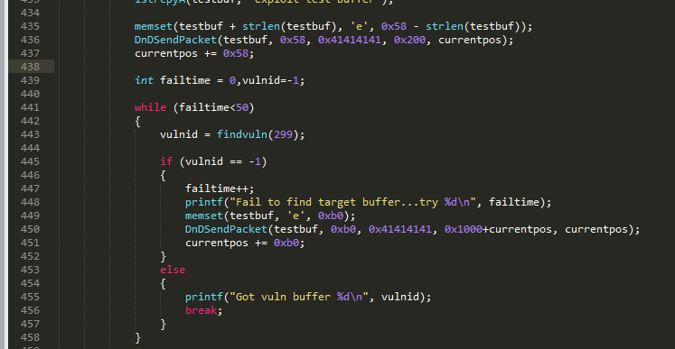


获取泄漏的信息，绕过ASLR
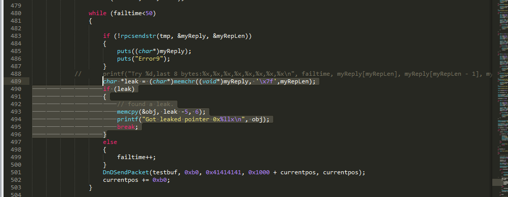

*** 3. 实现代码执行 ***
通过泄漏的信息，判断是指针是Dnd对象还是CP对象，然后设置不同的rop
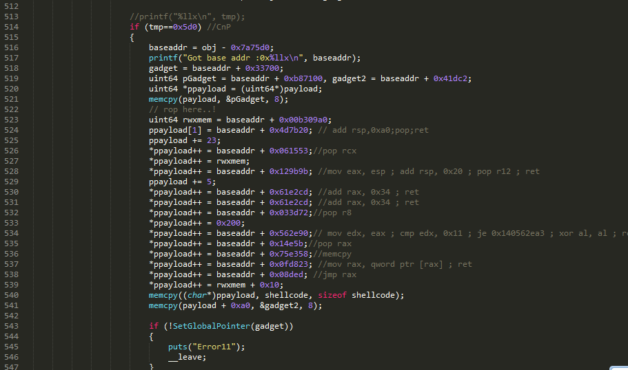
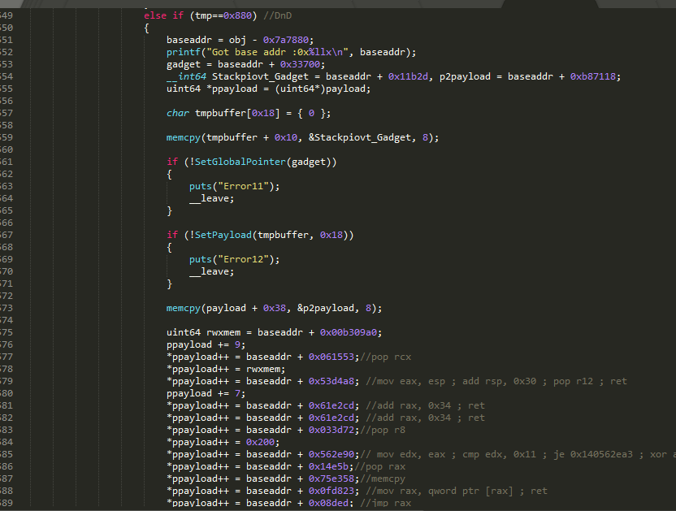
