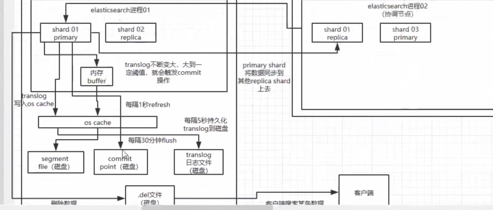
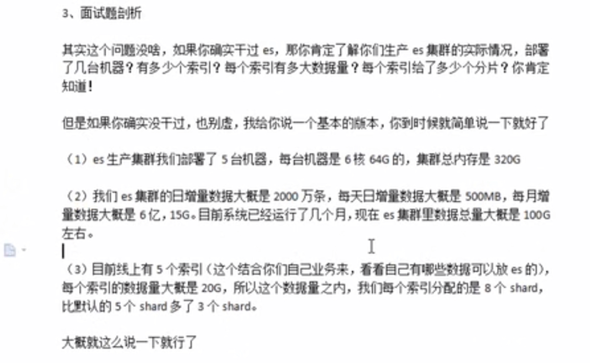
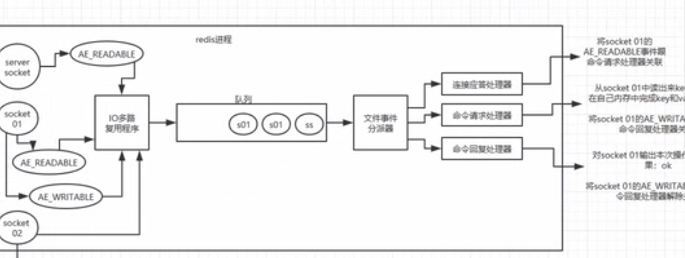
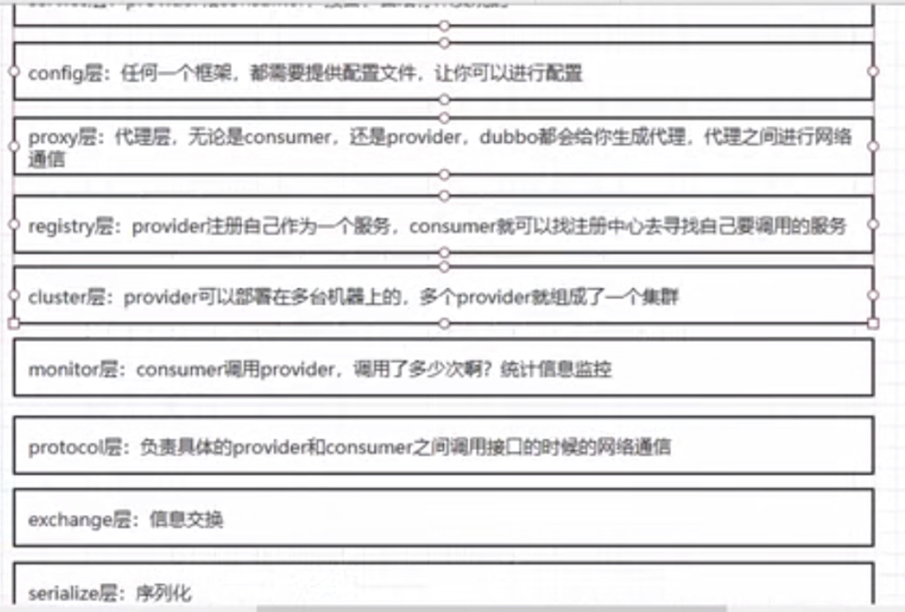
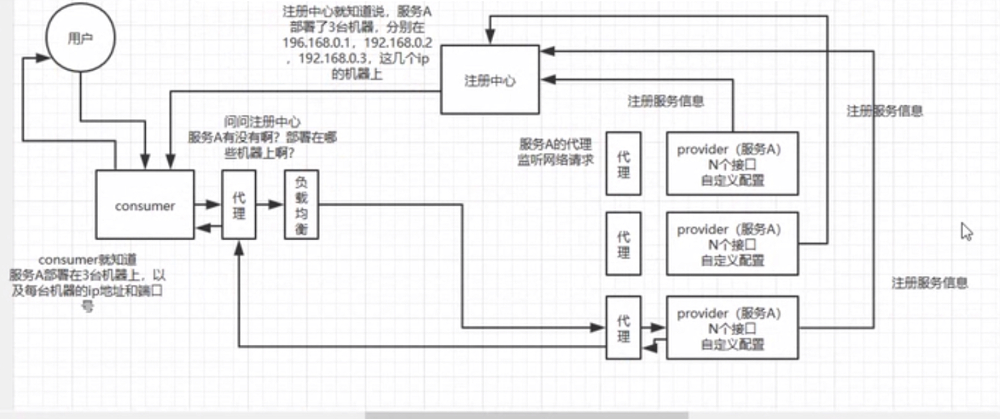
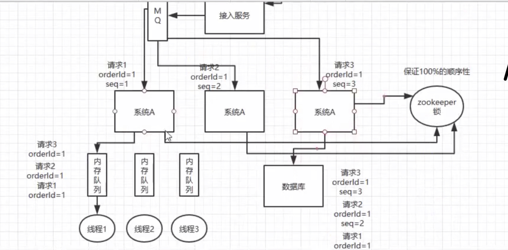
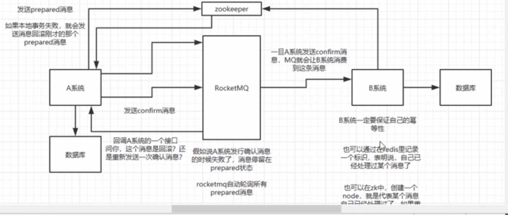
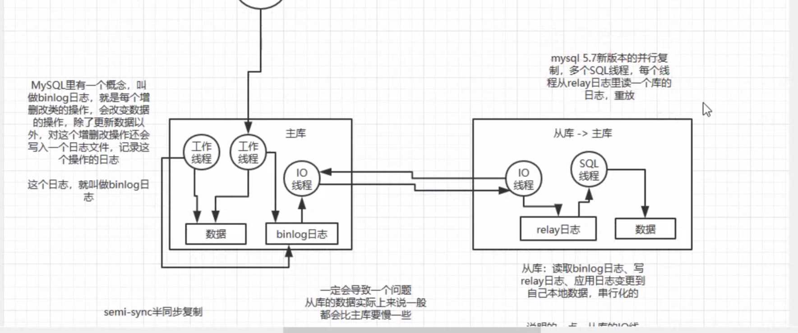

Haddop生态系统{
   A：	MapReduce:分布式计算框架
   B：	HDFS：分布式文件系统
   C：	HBase:实时、分布式、高维数据库
   D：	hive：数据仓库
   E：	Pig:数据流处理语言
   F：	Mahout：数据挖掘
   G：	Flume：日志收集工具
   H：	Sqoop：关系数据ETL工具
   I：	Zookeeper：分布式协作服务
   J：	storm：流式计算框架

   D:habinate是把对象转为sql语句，hive是把sql转为java对象
}

元数据：数据的属性名字

(
CDH
impala：实时查询分析引擎
)
Clawer4j{
	a:   从百度跳转
	b：带请求参数
	c：mysql定时任务导入种子到redis，监控redis种子数量
	d：mongodb创建索引
	e：按照时间扫描mongodb数据库，推入hdfs；控制hdfs文件大小固定为1G左右，文件名字包含mongodb数据时间信息
	f：需求：扫描hdfs日志，解析出searchword并推入redis
		1：对hdfs文件去重
		2：解析出所有searchword
		3：查重推送到seedQueue并添加到mysql
		4：布隆过滤器去重
	g:按照时间段扫描mongodb并去重推送到redis
}
数仓{
     Apache框架版本：(
	Hadoop-2.7.2
	Flume-1.7.0
	Kafka-0.11.0.2
	Kafka Manager-1.3.3.22
	Hive-1.2.1
	Sqoop-1.4.6
	Mysql-5.6.24
	Azkaban-2.5.0
	Java-1.8
	Zookeeper-3.4.10
	Presto-0.189
)
    CDH框架版本：(
	Hadoop-2.6.0
	Spark-1.6.0(默认，实际开发2.0以上)
	Flume-1.6.0
	Hive-1.1.0
	Sqoop-1.4.6
	Oozie-4.1.0
	Zookeeper-3.4.5
	Impala-2.9.0
)
}
Hadoop{
	
（
开启回收站的功能，以防不小心删除hdfs中的文件：
<property>
   <name>fs.trash.interval</name>
<value>1</value>
</property>
）
（	namenode故障处理：1.kill -9 NameNode进程
			2.删除NameNode存储的数据：rm -rf /opt/module/hadoop-2.7.2/data/tmp/dfs/name/*
			3.copy SN中的数据到原NN存储数据目录
			4.重启NN
）
（	stuffle过程中内存缓冲区越大，io次数越少：io.sort.mb默认100M
	partitioner为了把相同key的数据输出到同一个reducer中
）
（	1）Core-site.xml 文件的优化
       a、fs.trash.interval，默认值： 0；说明： 这个是开启hdfs文件删除自动转移到垃圾箱的选项，值为垃圾箱文件清除时间。一般开启这个会比较好，以防错误删除重要文件。单位是分钟。
       b、dfs.namenode.handler.count，默认值：10；说明：hadoop系统里启动的任务线程数，这里改为40，同样可以尝试该值大小对效率的影响变化进行最合适的值的设定。
       c、mapreduce.tasktracker.http.threads，默认值：40；说明：map和reduce是通过http进行数据传输的，这个是设置传输的并行线程数。
）
（
	Shuffle机制
		1）Map方法之后Reduce方法之前这段处理过程叫Shuffle
		2）Map方法之后，数据首先进入到分区方法，把数据标记好分区，然后把数据发送到环形缓冲区；环形缓冲区默认大小100m，环形缓冲区达到80%时，进行溢写；溢写前对数据进行排序，排序按照对key的索引进行字典顺序排序，排序的手段快排；溢写产生大量溢写文件，需要对溢写文件进行归并排序；对溢写的文件也可以进行Combiner操作，前提是汇总操作，求平均值不行。最后将文件按照分区存储到磁盘，等待Reduce端拉取。
		3）每个Reduce拉取Map端对应分区的数据。拉取数据后先存储到内存中，内存不够了，再存储到磁盘。拉取完所有数据后，采用归并排序将内存和磁盘中的数据都进行排序。在进入Reduce方法前，可以对数据进行分组操作。
）
（
	Hadoop优化
0）HDFS小文件影响（框架默认Textinputformat不管文件多小，都会是一个单独的切片，CombineTextinputformat会把多个小文件从逻辑上规划到一个切片中）
（1）影响NameNode的寿命，因为文件元数据存储在NameNode的内存中
（2）影响计算引擎的任务数量，比如每个小的文件都会生成一个Map任务
1）数据输入小文件处理：
（1）合并小文件：对小文件进行归档（Har）、自定义Inputformat将小文件存储成SequenceFile文件。
（2）采用ConbinFileInputFormat来作为输入，解决输入端大量小文件场景。
（3）对于大量小文件Job，可以开启JVM重用。
2）Map阶段
（1）增大环形缓冲区大小。由100m扩大到200m
（2）增大环形缓冲区溢写的比例。由80%扩大到90%
（3）减少对溢写文件的merge次数。
（4）不影响实际业务的前提下，采用Combiner提前合并，减少 I/O。
3）Reduce阶段
（1）合理设置Map和Reduce数：两个都不能设置太少，也不能设置太多。太少，会导致Task等待，延长处理时间；太多，会导致 Map、Reduce任务间竞争资源，造成处理超时等错误。
（2）设置Map、Reduce共存：调整slowstart.completedmaps参数，使Map运行到一定程度后，Reduce也开始运行，减少Reduce的等待时间。
（3）规避使用Reduce，因为Reduce在用于连接数据集的时候将会产生大量的网络消耗。
（4）增加每个Reduce去Map中拿数据的并行数
（5）集群性能可以的前提下，增大Reduce端存储数据内存的大小。 
4）IO传输
（1）采用数据压缩的方式，减少网络IO的的时间。安装Snappy和LZOP压缩编码器。
（2）使用SequenceFile二进制文件
5）整体
（1）MapTask默认内存大小为1G，可以增加MapTask内存大小为4-5g
（2）ReduceTask默认内存大小为1G，可以增加ReduceTask内存大小为4-5g
（3）可以增加MapTask的cpu核数，增加ReduceTask的CPU核数
（4）增加每个Container的CPU核数和内存大小
（5）调整每个Map Task和Reduce Task最大重试次数
）
	yarn(
	资源调度器有三种，Capacity Scheduler（默认）	、FIFO、Fair Scheduler。
)
}

HBase{
	如果集群之间的节点时间不同步，会导致regionserver无法启动，抛出ClockOutOfSyncException异常：属性：hbase.master.maxclockskew设置更大的值
	当storefile文件的数量增长到一定阀值后，系统会进行合并（minor：小范围合并，不会影响系统正常工作；major：所有文件进行合并，会影响正常工作，形成更大的storefile）
	rowkey：
		1。越小越好
		2。根据实际业务来
		3。散列性
			取反/Hash
	关闭自动major compaction
	手动编程major compaction
}
Hive{
（
	分区字段不能在表的列中
	内部表：hive管理，删除内部表会直接删除元数据及存储数据
	外部表：hdfs管理，删除外部表仅仅删除元数据	
	添加分区的时候，必须在现有分区的基础之上
	删除分区的时候，会将所有存在的分区都删除
	开启本地模式：set hive.exec.mode.local.auto=false
	开启并行模式：set hive.exec.parallel=true
	order对查询结果做全排序，只允许有一个reducer处理（当数据量较大时，应慎用，严格模式下，必须结合limit来使用）
）
（
	数据类型：array     map     struct    string
）
（
	常用函数：date_add(date1,int1):返回日期date1加上int1的日期
		date_sub(date1,int1):返回日期date1减去int1的日期
		concat(string1,string2):返回拼接string1及string2后的字符串
		explode(map):返回多行map键值对对应元素
	窗口函数：
		1） OVER()：指定分析函数工作的数据窗口大小，这个数据窗口大小可能会随着行的变而变化
		2）CURRENT ROW：当前行
		3）n PRECEDING：往前n行数据
		4） n FOLLOWING：往后n行数据
		5）UNBOUNDED：起点，UNBOUNDED PRECEDING 表示从前面的起点， UNBOUNDED FOLLOWING表示到后面的终点
		6） LAG(col,n)：往前第n行数据
		7）LEAD(col,n)：往后第n行数据
		8） NTILE(n)：把有序分区中的行分发到指定数据的组中，各个组有编号，编号从1开始，对于每一行，NTILE返回此行所属的组的编号。注意：n必须为int类型。

）
（
	自定义函数（方便定位错误）：UDF（解析公共字段）：extends UDF
		 UDTF（解析事件字段）
）
（
	什么时候用mr（基于文件）统计：当数据量大的时候。
）
（
	调优：
		数据倾斜：1，key分布不均匀
			2，业务数据本身的特性
			3，SQL语句造成的
			解决办法：
				a：hive.groupby.skewindata=true：数据倾斜时负载均衡，当选项设定为true，生成的查询计划会有两个MRJob。
				b，第一个MRJob 中，Map的输出结果集合会随机分布到Reduce中，每个Reduce做部分聚合操作，并输出结果，这样处理的结果是相同的GroupBy Key 
					有可能被分发到不同的Reduce中，从而达到负载均衡的目的；
				c，第二个MRJob再根据预处理的数据结果按照GroupBy Key分布到Reduce中（这个过程可以保证相同的GroupBy Key被分布到同一个Reduce中），最					后完成最终的聚合操作。
		合并小文件

			hive.merg.mapfiles=true：合并map输出 
			hive.merge.mapredfiles=false：合并reduce输出 
			hive.merge.size.per.task=256*1000*1000：合并文件的大小 
			hive.mergejob.maponly=true：如果支持CombineHiveInputFormat则生成只有Map的任务执行merge 
			hive.merge.smallfiles.avgsize=16000000：文件的平均大小小于该值时，会启动一个MR任务执行merge。
		Fetch抓取：
			Fetch抓取是指，Hive中对某些情况的查询可以不必使用MapReduce计算。例如：SELECT * FROM employees;在这种情况下，Hive可以简单地读取employee			对应的存储目录下的文件，然后输出查询结果到控制台。
			在hive-default.xml.template文件中hive.fetch.task.conversion默认是more，老版本hive默认是minimal，该属性修改为more以后，在全局查找、			字段查找、limit查找等都不走mapreduce。
		Hive可以通过本地模式在单台机器上处理所有的任务。对于小数据集，执行时间可以明显被缩短。
			set hive.exec.mode.local.auto=true;  //开启本地mr
			//设置local mr的最大输入数据量，当输入数据量小于这个值时采用local  mr的方式，默认为134217728，即128M
			set hive.exec.mode.local.auto.inputbytes.max=50000000;
			//设置local mr的最大输入文件个数，当输入文件个数小于这个值时采用local mr的方式，默认为4
			set hive.exec.mode.local.auto.input.files.max=10;
）	
（
	面试题：
		1，Hive中追加导入数据的4种方式是什么？请写出简要语法
			从本地导入： load data local inpath ‘/home/1.txt’ (overwrite)into table student;
			从Hdfs导入： load data inpath ‘/user/hive/warehouse/1.txt’ (overwrite)into table student;
			查询导入： create table student1 as select * from student;(也可以具体查询某项数据)
			查询结果导入：insert （overwrite）into table staff select * from track_log;
		2，海量数据分布在100台电脑中，想个办法高效统计出这批数据的TOP10？
		方案1
			求出每台电脑上的TOP10后，然后把这100台电脑上的TOP10组合起来，共1000个数据
			再利用上面类似的方法求出TOP10就可以了。
		3，Combiner聚合

			hive.map.aggr=true;在map中会做部分聚集操作，效率更高但需要更多的内存。 
			hive.groupby.mapaggr.checkinterval：在Map端进行聚合操作的条目数目
		4，可视化工具：TreeSoft
		5，三范式：a：属性不可分割。b，不能存在部分函数依赖。 C，不能存在传递函数依赖。

		sql. Limit.  reduce堆内存溢出（oom异常），可以在yarn-site.xml中指定内存a
）	
(
	create table business(name string,orderdate string, cost int)
	row format delimited fields terminated by ',';
	
	load data local inapt 'business.txt' into table business;
	
	查询在2017年4月份购买过的顾客及总人数。 
	select name, count(*) over() from business where substring(orderdate,1,7) = '2017-04' group by name;
	查询顾客的购买明细及月购买总额。
	select name,orderdate, cost,sum(cost) over(distribute by name) from business;
	上述场景，要将cost按照日期进行累加。
	select name,orderdate, cost,sum(cost) over(distribute by name sort by orderdate) from business;
	查询顾客上次的购买时间。
	select name,orderdate,cost, lag(orderdate,1,'1970-01-01') over(distribute by name sort by orderdate) from business;
	查询前20%时间的订单信息。
	select name,orderdate,cost from (select name,orderdate,cost,ntile(5) over(order by orderdate) ntile_5 from business)t1 where ntile_5=1;
	
	userId.   visitDate.   visitCount
	统计出每个用户的累积访问次数。
	select userId,mn,sum_visitCount,sum(visitCount) over(portion by userId order by mn) from (select userId, mn,sum(visitCount) sum_visitCount from (select userId,date_format(regexp_replace(visitDate,'/','-'),'yyyy-MM') mn,visitCount from action)t1 group by userId)t2;
	
	user_id.   Shop
	计算uv。
	select shop,count(*) uv from (select shop,user_id from visit group by user_id,shop)t1 group by shop;
	计算每个店铺的top3.
	select shop,user_id ct from(select sjop,user_id,ct,row_number() over(partition by shop order by ct desc)rk from(select shop, user_id,count(*)ct from visit group by shop,user_id)t1)t2 where rk<=3;
) 
}

flume{
（
    source：源    
        对channel而言，相当于生产者，通过接收各种格式数据发送给channel进行传输

    channel：通道
        相当于数据缓冲区，接收source数据发送给sink
    
    sink：沉槽
        对channel而言，相当于消费者，通过接收channel数据通过指定数据类型发送到指定位置
    
        # 配置sink
            a1.sinks.k1.type = logger
            # 配置channel
            a1.channels.c1.type = memory
            a1.channels.c1.capacity = 1000
            a1.channels.c1.transactionCapacity = 100
）
（
	优化：
		通过配置dataDirs指向多个路径，每个路径对应不同的硬盘，增大Flume吞吐量。
 		checkpointDir和backupCheckpointDir也尽量配置在不同硬盘对应的目录中，保证checkpoint坏掉后，可以快速使用backupCheckpointDir恢复数据。

）
}
kafka{
(
	Kafka分区分配策略:
		在 Kafka内部存在两种默认的分区分配策略：Range和 RoundRobin。
			Range是默认策略。Range是对每个Topic而言的（即一个Topic一个Topic分），首先对同一个Topic里面的分区按照序号进行排序，并对消费者按照字母顺序进行排序。然后用Partitions分区的个数除以消费者线程的总数来决定每个消费者线程消费几个分区。如果除不尽，那么前面几个消费者线程将会多消费一个分区。
			RoundRobin：前提：同一个Consumer Group里面的所有消费者的num.streams（消费者消费线程数）必须相等；每个消费者订阅的主题必须相同。
			第一步：将所有主题分区组成TopicAndPartition列表，然后对TopicAndPartition列表按照hashCode进行排序，最后按照轮询的方式发给每一个消费线程。
	Kafka消息数据积压，Kafka消费能力不足怎么处理？ 
		1）如果是Kafka消费能力不足，则可以考虑增加Topic的分区数，并且同时提升消费组的消费者数量，消费者数=分区数。（两者缺一不可）
		2）如果是下游的数据处理不及时：提高每批次拉取的数量。批次拉取数据过少（拉取数据/处理时间<生产速度），使处理的数据小于生产的数据，也会造成数据积压。

	高可用：
		假设有三台机器，每个机器有一个broker，相当于kafka节点，客户端发送一个topic，包含三个消息，根据partition分配到三个节点上。每个节点包含元数据和实际数据，每个节点又有两个副本，一个leader，一个follower。
	消息丢失：
		1.消费端弄丢消息（消费者拿到数据还没有用自己就挂了，如果是自动提交数据就丢失了）
			关闭自动提交，手动提交。
		2.kafka弄丢消息
			设置四个参数：1.replication.factor；这个值必须大于一，每个partition必须有两个以上副本。
				   2.min.insync.replicas:必须大于一，要求leader至少感知到至少有一个follower还跟自己保持联系。
				   3.ack = all:要求每条数据必须写入所有副本才算成功。
				   4.retries=MAX:写入失败后无限重试。
	保证消费顺序：
		rabbitmq：场景：生产者发过来四个数据，增删改查，这时可能先删除又增加了，数据就不对了。
			解决办法：	把需要保证顺序的消息发送到同一个queue里。
		kafka：场景：每个partition里的消息一定是有序的，所以消费者取出来的消息也是有序的，但是多个线程就会出现消息错乱。
			解决办法：内存队列，把经过hash到相同内存队列的数据经过同一个线程取出来，就是有序的了。
	## 如何通过offset寻找数据
	
		如果consumer要找offset是1008的消息，那么，
	
		1，按照二分法找到小于1008的segment，也就是00000000000000001000.log和00000000000000001000.index
	
		2，用目标offset减去文件名中的offset得到消息在这个segment中的偏移量。也就是1008-1000=8，偏移量是8。
	
		3，再次用二分法在index文件中找到对应的索引，也就是第三行6,45。
	
		4，到log文件中，从偏移量45的位置开始（实际上这里的消息offset是1006），顺序查找，直到找到offset为1008的消息。查找期间kafka是按照log的存储格式来判断一条消息是否结束的。
	
		[参考文章](<https://blog.csdn.net/lkforce/article/details/77854813>)
	数据积压：
		1.扩容，添加一个节点，多分点partition，用来快速消费积压节点。
)
底层原理：复制的底层原理、leader选举算法、增加partition之后的reblance算法、如何优化kafka的吞吐量。
}

elasticsearch
{

	写流程：数据首先会被分配到一个节点，这个节点被称作协调节点，然后把数据路由到其他节点的shard primary上，同时备份一个shard replica，primary shard将数据同步到其他的replica shard上。primary shard的数据会被加载到buffer里，每隔一秒refresh到os cache中，这时用户已经能够查询了，所以会有一秒的延迟，准实时。前面的数据会被写入到translog，因为前面的数据都是在内存中，以防宕机，每隔5秒os cache中的数据会被flush到segment file（磁盘），所以有可能丢失5秒的数据，同时已经建立好了倒排索引，(正排：扫描所有文档，把包含关键词的找出来，然后相关度评分，排序，当数据量很大时，就不行了；倒排：关键词{相关文档的id。。。。})
	删除：数据删除（软删除）之后会用一个标识记录到。del文件里，当用户搜索时，如果在这个文件里有了，就不会在搜索了。
	
	搜索优化：
		1.让少量字段的index比如ID，orderid，你用来搜索的那些索引，保存在os cache中，然后再携带id，orderid取mysql/hbase里去查询，返回给前端。一般是建议es+hbase的架构，hbase适合海量数据的简单查询，拿着id取查询就好了。
		2.数据预热：可以专门搞一个后台系统，比如那些微博大v的数据肯定就是热点数据，这个系统每隔一分钟就去查询，这样数据就可以保留在os cache中了。
		3.冷热分离：假如有6个节点，建立一个热数据index，一个冷数据index，两个index分到三个shard中去，大量的访问热数据index，这样热数据index就几乎都保留在os cache中了，但是冷数据保留在了磁盘上，会比较慢。
		4.document模型设计：假如有两张表，订单表和商品表，这两个表是一对多的关系，select * from order join item on ...虽然es也支持这种复杂查询，但是性能必然会下降，一般不建议这么做。可以在商品写入es的时候就提前完成查询，写入es。不要在查询的时候做复杂操作，比如join，nested，parent-child等。
		5.分页查询：假如查询第100页，每页50个数据，假如有5个shard，那么就有5000条数据，实际上es会从每个shard查询1000条，shard再根据算法将5000条数据分页，拿到第100页的数据。页数越深，查询速度就越慢。可以考虑用scroll api，滚动索引，即会一次性查询出来生成一个快照，翻页的时候移动索引，类似于微博往下 翻页，通过游标不断获取下一页数据，性能是很高的。但是scroll api只适用于那种下拉刷微博的情况，不能随意跳到任意一页的场景。
	底层原理：相关度评分算法（TF/IDF算法）、deep paging、上千万数据批处理、跨机房集群同步、搜索效果优化。
}
redis
{

	过期策略：惰性删除+定期删除，随机选出几个key删除，而不是一次性删除，如果有10万个key同时过期，那redis就死了。
	内存淘汰机制有：LRU、random。。
	
	哨兵模式：
		读写分离：假设三台节点，一台master做写，两个做读。可以水平扩展slave，这时候如果slave是第一次连接master，会触发full resynchronization，master会启动一个线程生成一份RDB快照保存到本地，然后发送给slave来进行同步。如果采用了主从架构必须采用master的持久化。
		1.主从复制的断点续传：redis2.8以后支持断点续传，如果传输的过程中网络断了，可以从断了的位置接着传输，但是如果没有找到对应的offset就要重新执行full resynchronization。
		2。无磁盘化复制：在内存中生成一份RDB，直接发送给slave。
	宕机：如果slave在指定的时间内（配置文件）没有收到master的消息，那么就认为master宕机了。如果这时候也收到了其他哨兵认为master宕机的消息，就称为odown了。如果master被认为odown了，slave也被允许可以主备切换，那么slave就会选举一个master，首先会考虑优先级、跟master断开连接的时长、复制offset、run id。
	自动发现机制：每个slave都会往slave每隔两秒往sentinel发送一个消息（自己的host、ip），哨兵通过这个消息来来感知其他哨兵的存在。
	分布式redis cluster：
		1.最古老的hash算法：假设有三个节点，首先对进来的数据进行hash，然后对3取模，分布到三个节点上。如果有一个节点挂了，那么hash值就会对2取模，本来应该在第一个节点上的数据到了第二个节点上，数据就全乱了，三个节点的数据都不可用了。
		2.一致性hash算法（自动缓存迁移+虚拟节点，自动负载均衡）：先对数据进行hash，每个节点分布在一个hash环上，根据hash值顺时针寻找最近的一个节点存入数据，如果这个节点挂了，会顺时针继续寻找，只有挂掉的一个节点不可用。（问题，节点少的时候某两个节点的范围可能太大，造成某个节点的压力过大，可以采用虚拟节点，比如：有一个A节点，在给他分配两个A1、A2两个虚拟节点，hash环上A1和A2的范围的请求也分配给A）
		3.hash slot：redis cluster有固定的16384个hash slot，对每个key计算CRC16值，然后对16384进行取模。增加master就让其他master的移动部分ash slot过去，删除就把当前的hash slot增加到其他的master上。客户端可以通过hash tag实现指定数据到同一个hash slot上。
	缓存雪崩：当redis全部挂了，大量请求压入数据库，导致数据库也挂了，那么整个系统就挂了。在系统内部实现两个组件（流控+ehcache），流控组件把一部分请求放行查询数据库，另一部分请求直接返回给客户，返回null或者一个提示，客户可能多刷几次就能查询了，并不会有太大的影响。
	缓存穿透，由于黑客攻击，缓存里没有要查询的数据，比如id是负数的，这时候可以往缓存里放入null值，比如set（-99，UNKOWN），这样下次就走缓存了。
	删除缓存而不是更新缓存：假如一个缓存对应了多个表，你频繁更新了20次，那么这个缓存也要更新20次，但是这个缓存只被读取了一次。如果你删除缓存的话，就不用频繁更新，什么时候用什么时候再查就可以了。
}
dubbo
{

	负载均衡：轮训、随机、一致性hash、权重。
	fail-over机制：当前节点请求失败就分发到其他节点。
	协议：支持http协议和hessian协议，hessian通过对字节的包装，转换成字节数组。
	安全：dubbo+zookeeper实现安全机制，zokeeper支持：
		1.当提供者出现断电时，zookeeper自动删除provider的信息，等zookeeper重启时，会自动恢复注册数据，以及订阅请求。
		2.当设置<dubbo：registry check=”false“/>时，记录失败注册和订阅请求，后台定时重试。
		3.设置username和password，

}
如何保障分布式请求的顺序
{

	弱一致性：当在请求和服务之间增加一个组件，类似于dubbo，采用hash广播，比如同一个orderid的请求映射到同一个服务上。
	强一致性：虽然转发到了同一个服务上，但是多线程下依然会有顺序问题，这时候可以给每一个线程增加一个内存队列。
		用zookeeper当分布式锁。虽然redis也可以，但是redis是有问题的比如，哨兵模式，还没来得及分发给slave，master挂了。
}
分布式session
{
	memcached、redisSessionManager、spring-session。
}
分布式事务
{

	可靠消息最终一致性方案：假设有两个系统A、系统B，rocketmq做消息中间件。系统A向系统B请求，首先向rocketmq发送prepared消息，此时消费者不可见。然后执行本地事务的回调函数execcuteLocalTransaction()，有三种返回结果，COMMIT_MESSAGE、ROLLBACK_MESSAGE、UNKNOW。
		COMMIT_MESSAGE：将不可见消息变为可见；
		ROLLBACK_MESSAGE：broker回收那个不可见消息，同时系统A执行本地实现的回退方案；
		UNKNOW：broker会定时主动回调checkLocalTransaction()方法，判断系统A事务是否正常。
执行完上面的步骤后，消费者消费消息。如果系统B消费失败了，会将失败的消息回传给broker，即重新写入commitLog文件，重新进行消费，默认16次。
		Question1:如何保持发送prepare消息和producer本地事务的一致性？
			代码中是顺序执行的，先发送prepared消息，再执行的本地事务，所以不存在问题。
		Question2：如果mq到系统B的过程中消息消费失败了，因为我们保证的是最终一致性，我们的系统B会不断重试消费直到默认的16次。所以并不会影响我们的消息最终一致性。

		rocketmq版本：3.2.6之前，支持函数回调。
	
	XA两阶段提交方案：
		第一阶段，所有参与者将自己能否成功的信息反馈给协调者；第二阶段：执行阶段，协调者通知所有参与者一致的在所有分支上执行提交或者回滚。
}
*mysql*
{
	分库分表之后怎么生成唯一ID？
		1.uuid，生成很长的字符串，作为id来说太长了，影响性能。
		2.时间戳：在同一时间会造成id重复。不可用。
		3.搞一个单独的数据库，只放一张表，采用自增id的方式，专门生成id用，插入新数据来，从这张表取一个id插入到新表。
		4.twiter：雪花snowflake算法，64位，第一位统一是0，因为二进制第一位如果是一，那么就是负数了。第二个41位，时间戳，第三机房id，第四机器id，第五个是记录每毫米能产生多少个id的值，最多每毫秒产生4096个。

读写分离+主从复制：

	主库做写，从库做读。写到数据库时，开启一个工作线程将操作写到binlog日志中，然后从库开启一个io线程（多线程）将binlog读到从库，生成一个relay日志，然后sql线程（单线程，mysql5.6之前）将relay日志写到从库，mysql5.7之后sql线程变成了多线程。我们做过压测，每秒2000个请求，从库读大概有几十毫秒的延迟。第一这时候可以进一步对主库进行拆分，将一个主库分成4个库降低延迟。第二可以写代码的时候让从库更新完再查询。第三开启半同步复制，主库写入binlog此时就立刻将数据同步到从库，从库返回一个ack给主库，主库接收到至少一个ack之后才认为写操作完成了。
	show status;   Seconds_Behind_Master. 可以看到主从复制延迟了几ms。
调优：当使用了覆盖索引时，Explain 的extra字段是using index，否则是using file sort，创建索引，首先是覆盖索引，因为覆盖索引可以减少回表操作。如果存储介质是机械硬盘的话，很怕随机读写，它有一个磁盘寻址的开销，可以把Mrr（multi range read）打开，它可以把在回表之前，读到buffer里面，它可以把随机操作变成顺序操作。覆盖索引可以避免排序用到的一些临时文件，可以配合最左原则，减少索引的维护。如果是写多读少的服务，当我们的业务唯一性没有那么高，并且业务代码可以保证唯一性的时候，我们可以用普通索引，普通索引用到 change buffer，它可以把写操作缓存下来，当我们读的时候进行一个merge的操作，提高写入的速度和内存的命中率。

}
高可用
{
	微服务架构本身就是一种高可用架构：假如把一个服务拆分成ABC三个子服务，那么A挂了，不至于导致整个服务挂掉。但是有一个问题，假如有100个线程调用ABC，但是A挂了，调用A的30个线程就会卡住，那么就会用剩下的70个线程继续对A服务调用，又卡住了，这时100个线程全卡了，那么上层服务就挂了，导致了故障蔓延。

	hystrix：当系统可用性达到99.99的时候，假如该服务有30个依赖服务，99.99%的30次方，99.7%，那么一亿次就有300万次请求失败，每月两个小时的请求失败。基于注解使用，@HystrixCommand（FALLBAcK=fallback）（好像）。它的实现方式：
		1.可以实现服务熔断。
		2.fallback服务降级。
		3.监控+报警。
		4.默认超过10s，调用次数超过20次，失败率超过50%，会返回开发者的fallback。
		5.搞一个独立的线程池或者是信号量semaphore，当线程池或者是信号量满了就拒绝调用。
		6.对属性或者是配置近乎实时的生效。	
}
JVM
{
	https://www.jianshu.com/p/76959115d486

	gc回收四种算法：1.标记清除：对存活对象进行标记，对未标记对象进行回收。缺点：内存碎片。
		2.复制：拿出50%空间用来存放存活对象，另外50%空间进行清除。缺点：浪费了一半空间。
		3.标记-整理：与标记清除算法一样，前期都是标记，但是最后将所有对象向一端移动，清理掉边界以外的内存。解决了标记清除的内存碎片化。
		4.“分代收集”（Generational Collection）算法，是一种划分的策略，把Java堆分为新生代和老年代，这样就可以根据各个年代的特点采用最适当的收集算法。在新生代中，每次垃圾收集时都发现有大批对象死去，只有少量存活，那就选用复制算法，只需要付出少量存活对象的复制成本就可以完成收集。而老年代中因为对象存活率高、没有额外空间对它进行分配担保，就必须使用“标记-清理”或“标记-整理”算法来进行回收。
	垃圾收集器：串行收集器、并行收集器等等。
}
线程池
{
	newFixedThreadPool(
		corepoolsize,
		maxnumThreadpool,
		keepalivetime,
		linkedblockqueue(),//无界队列
		)
	1.在远程服务异常的情况下，使用无界阻塞队列，是否会导致内存飙升？
		因为远程服务异常，线程阻塞，不断的有任务进到队列，因为是无界队列，所以越来越大。导致oom内存飙升。
	2.如果线程池的队列满了以后，会发生什么事情？
		有界队列，可以避免内存溢出。线程有自己的栈内存，占用一定的内存资源，也会导致资源耗尽，系统挂掉。我们还可以把超出的任务持久化到磁盘，然后后台专门写一个线程来读取。
	3.如果机器宕掉，队列中任务丢失了怎么办？
		先把任务持久化存储到mysql里，给一个标示，已提交、未提交，重启之后再去读取。
	进程间通信四种方式：管道、命名管道、消息队列、共享内存。
	线程间上下文如何切换？每个线程有一个时间片，线程结束了，就保存这个线程的状态，切换到下一个线程。
}
网络
{
	http协议：
		1.0:短连接，每次请求建立一个连接，先三次握手，非常慢。
		1.1:长连接。
		2.0:长连接加多路复用，解决一个长连接只能对一个域名请求一次的问题。
	https：网站把支持的加密规则发送给服务器，服务器从中随机选择一个发送回去给浏览器，然后浏览器验证，加密，这块走的是非对称加密，RSA。
}

NIO
{
	服务器里有一个selector，这个selector监听这多个channel，当有客户端连接上channel时，selector会创建一个线程去读取，然后读取完这个线程就销毁了。
}

小米：
交叉链表判断；
链表环判断；
判断平衡二叉树；
wait和sleep
Object下都有哪些方法
equals和==,==比较hashcode了吗。
git merge（https://blog.csdn.net/zl1zl2zl3/article/details/94019526） 等。。
maven的scope

反射的性能问题；

未来规划：
1.找一个稳定的工作
2.考研

